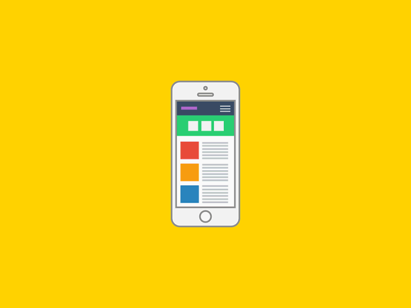
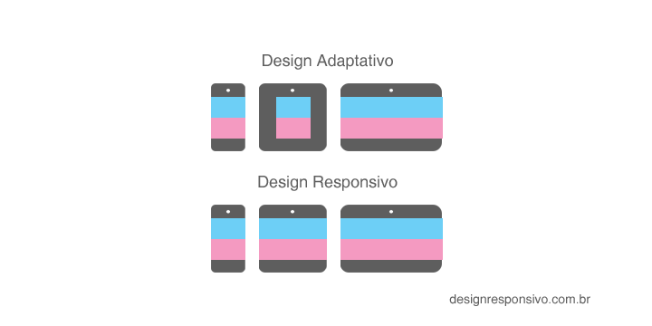

# T2-Online-Web-Responsivo
Material para aula da semana 1 de web responsivo 

#### O que é design responsivo ?


Cada dia a variedade de dispositivos cresce e com ela o acesso ao site pode ser visto de diversas formas em: laptops, tablets, netbooks, celulares, desktops com tela pequena, iMacs com telas gigantescas, televisão, etc. Imagina escrever um código para cada versão ? 


Foi por isso que criou o conceito de design responsivo
Design responsivo nada mais é do que o site estar adaptado em várias telas e tentar atingir o máximo de dispositivos possíveis
Desde do um celular até uma tv de 42 polegadas.




#### DIFERENÇA ENTRE RESPONSIVO E ADAPTIVO

O design responsivo acompanha o tamanho da tela. Já  o design adaptivo utiliza medidas fixas para ser criado. 



#### 2. Como utilizar o design responsivo

 ##### 2.1 Utilizar a ``metatag chamada viewport`` no ``` <head>``` do site 
 Essa tag vai passar instruções para o navegador para mudar o conteúdo conforme  o tamanho do dispositivo. 

```html
<head>
  <meta charset="utf-8">
  <meta name="viewport" content="width=device-width, initial-scale=1">
  <link href="css/style.css" rel="stylesheet">
</head>
```
##### 2.2 Utilizar as medias queries 

###### Media queries 
São breakpoints que modificam o CSS para cada resolução de tela. Breakpoint em programação significa uma pausa em algum momente específico determinado pelo programador. No caso de breakpoints de css, são as resoluções de tela nas quais queremos modificar o conteúdo do site.

Se [largura do dispositivo] for menor ou igual a 768px, então execute o {...}

```css
@media (max-width: 768px) {
  .nome-da-classe {
    color: #fff; /* elemento que vai ser modificado/adicionado/sobrescrito nessa resolução */
  }
}
```
Se [largura do dispositivo] for maior ou igual a 768px, então execute o {...}

```css
@media (min-width: 768px) {
  .nome-da-classe {
    color: #fff; /* elemento que vai ser modificado/adicionado/sobrescrito nessa resolução */
  }
}
```
Se [largura do dispositivo] for entre 768px e 600px, então execute o {...}

```css
@media (max-width: 768px) and (min-width: 600px) {
  .nome-da-classe {
    color: #fff; /* elemento que vai ser modificado/adicionado/sobrescrito nessa resolução */
  }
}
```
```css
/* esse é um bloco normal de css, o browser vai ler e mostrar esses valores na tela do usuário */
.box {
  border: 1px solid #000;
  width: 320px;
  height: 120px;
  background-color: red;
}
```
```css
/* esse é um bloco condicional, o browser vai ler e mostrar esses valores na tela do usuário SE a resolução da tela for menor que 768px */
@media (max-width: 768px) {
  .box {
    background-color: blue;
  }
}
```
```css
/* esse é um bloco condicional, o browser vai ler e mostrar esses valores na tela do usuário SE a resolução da tela for menor que 420px */
@media (max-width: 420px) {
  .box {
    width: 100%;
    background-color: yellow;
  }
}
```
----
#### 3. Medidas flexiveis 

Valores absolutos:

- px (pixels): O valor definido em px vai ser sempre o mesmo independente da resolução/tamanho da tela.

Valores relativos:

- em: A unidade em é uma unidade relativa com base no valor computado do tamanho da fonte do elemento pai. Isso significa que os elementos filhos são sempre dependentes de seus pais para definir seu tamanho de fonte.
rem: A unidade rem é relativa ao elemento root, ou seja, o valor da fonte definida no html ou body.


Uma técnica simples mas importante em páginas responsivas é evitar que as imagens estourem os elementos que as contém, no caso de usarmos uma resolução baixa com uma imagem grande. Atingimos isso com o max-width.
```css
img {
    max-width: 100%;
}
```
#### Testes
https://www.browserstack.com/
http://whatismyscreenresolution.net/multi-screen-test
https://www.browserstack.com/

---
#### 4- Exercicios 

Em aula utilizaremos as seguintes propriedades:
```css
1280px (desktop)
1024px (tablet - horizontal)
768px (tablet - vertical)
420px (mobile)
```
Exercicio 1 - Aula: https://www.figma.com/file/XdkhQ8kR2oBNiuCdIweA2YzF/Untitled
Exercicio 2 - Para entregar: https://www.figma.com/file/IeMoTl0HUkKX8vFMpak1ymJp/Responsivo-Reprograma
Exercicio 3 - Extra (Não obrigatório a entrega/resolução):
https://www.figma.com/file/m2Cr07L1gsWQoKf6X0yx8K/Exerc%C3%ADcio-extra-N%C3%A3o-obrigat%C3%B3rio-HTML-CSS
Exercício 4 - Extra (Não obrigatório a entrega/resolução):
https://www.figma.com/file/SxmXbT4lWspi7glqhfjIMFKE/Exercicio-Extra-Responsivo

